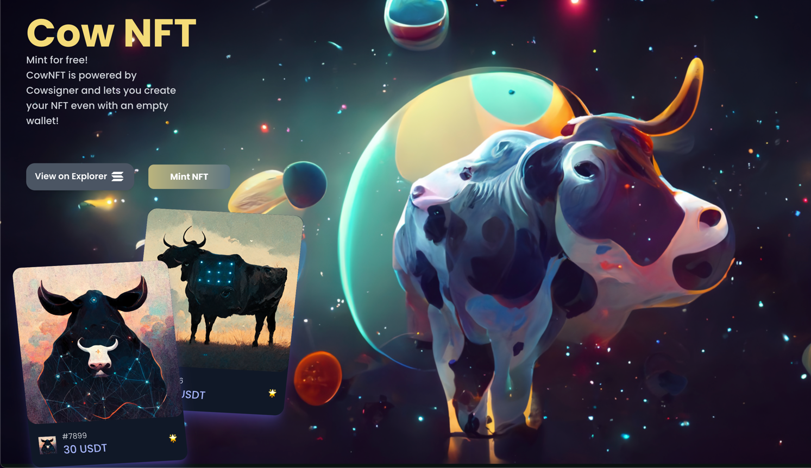

## Mint NFT for free on Solana 

### Check out the demo [here](https://nft.cowsigner.com/) 



---

[Visit Cowsigner](https://cowsigner.com "Visit Cowsigner!") -> Solana blockchain service to let your customer use blockchain for free!

### Install on Local
Create a `.env` file in the root of your project with the following structure

```
REACT_APP_SOLANA_RPC_HOST=https://api.devnet.solana.com
REACT_APP_CANDY_MACHINE_ID=*******

REACT_APP_COWSIGNER_APP_WALLET="*******"
REACT_APP_COWSIGNER_CONTRACT_ID="*******"
REACT_APP_COWSIGNER_ACCOUNT_ID="*******"
REACT_APP_COWSIGNER_API_KEY="*******"
```


`npm install`
`npm run start`

